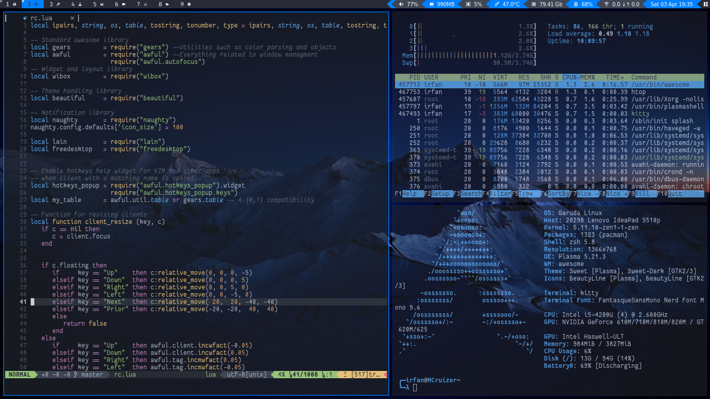
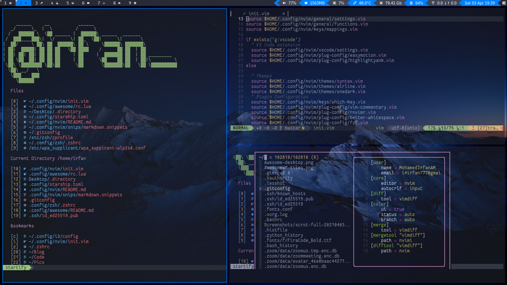
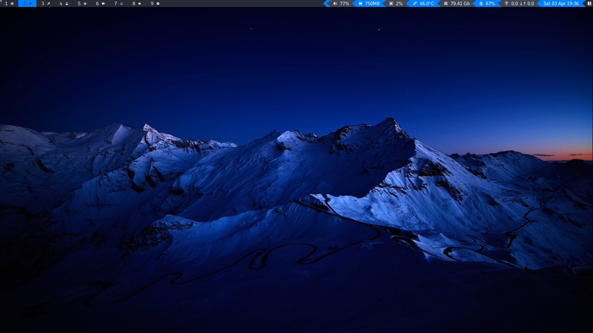

# AwesomeWM

My Awesome window manager config




## Install AwesomeWM

#### Arch Linux

```
sudo pacman -S awesome
```

#### Arch Linux AUR

```
sudo pacman -S --needed base-devel git
git clone https://aur.archlinux.org/awesome-git.git
cd awesome-git
makepkg -fsri
```

#### Debian-based

```
sudo apt build-dep awesome
git clone https://github.com/awesomewm/awesome
cd awesome
make package
sudo apt install *.deb
```

## Dependencies

##### Dmenu-distrotube

- Arch linux

```
  yay -S dmenu-distrotube-git
```

- Other linux distros

```
  git clone https://gitlab.com/dwt1/dmenu-distrotube.git
  cd dmenu-distrotube
  sudo make clean install
```

#### Nitrogen

- Debian Based

```
   sudo apt-get install nitrogen
```

- Arch Linux

```
   sudo pacman -S nitrogen
```

#### Picom, compositor

- Arch Linux

```
sudo pacman -S picom
```

#### Dmscripts

```
git clone https://gitlab.com/dwt1/dmscripts.git /.dmenu/

```

### Key Bindings

**• Awesome**

shift + super + q - quit awesome

shift + super = r - reload awesome

super + s -- hotkeys

super + w -- show main menu

super + b -- show/hide wibox

**• Basic apps**

super + enter -- terminal

super + shift + enter -- brave

super + space -- krunner

alt + space -- dmenu

**• close, minimize, maximize etc**

alt + q , alt + w -- close

alt + m -- minimize

alt + shift + m -- restore minimize

super + m -- toggle max/min

super + f -- full screen

super + t -- keep on top toggle

**• client management**

alt + tab -- cycle through apps

super + hjkl -- change focus by direction

super + shift + hjkl -- move clients by direction

super + ctrl + hjkl -- resize clients

super +ctrl + return -- move focused to master

super + u -- move to urgent client

ctr + alt +jk --- increase/decrease gaps

**• layout**

ctrl + tab -- switch layout

ctrl + shift+ tab -- reverse swith layout

super + space -- toggle floating mode of focused and super + drag

super + lefclick + drag -- move clients

super + rightclick + drag -- resize clients

super + control + space -- floating layout

super + shift + space -- tiling layout

**• Floating**

super + space -- toggle floating mode of focused and super + drag

super + lefclick + drag -- move clients

super + rightclick + drag -- resize clients

super + control + space -- floating layout

super + control + hjkl -- resize

super + alt + hjkl -- move in all four direction

**• Pop UP**

right-click to remove notification and left to take that notification

• Pop UP

right-click to remove notification and left to take that notification

• Tags

mod + tab -- next tag

mod + shift + tab -- previous tab

alt + ctrl + l -- next tag

alt + ctrl + h -- previous tag

mod + 1-9 -- view tag

mod + ctrl + 1-9 -- toggletag -- opening client will be in toggled tags

shift + super + 1-9 -- sent to tag

shift + super + ctrl + 1-9 -- toggle focuses tab of tags

**• Dynamic tagging**

super + shift + n -- new tag

super + control + r -- rename tag

super + shift + Right/left -- move tags

super + shift + d -- delete tags

**• Master and column manipulation**

Shift + alt + hl -- increase/decrease no. of master clients

Shift + alt + jk -- increase/decrease no. of columns

super +ctrl + return -- move focused to master

**• Volume and Brightness**

Volume up, volume down to adjust volume(alsa mixer)

Mute button to mute

ctrl + shift + m -- max volume

ctrl + shift + 0 -- mute

brightness up and brighness down to to adjust brightness

**• Dmenu**

alt + space -- dmenu

ctrl + alt + s -- search web using different engines

ctrl + alt + q -- Kill apps

ctrl + alt + c -- Scrot screen shot

ctrl + alt + e -- edit config file

ctrl + alt + m -- search man pages

ctrl + alt + x -- logout
